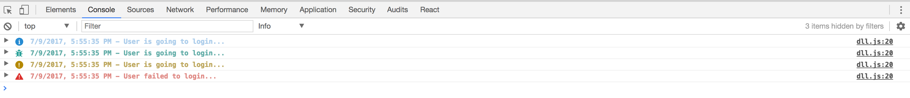
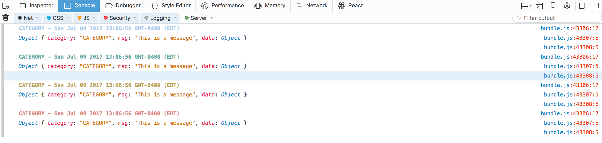
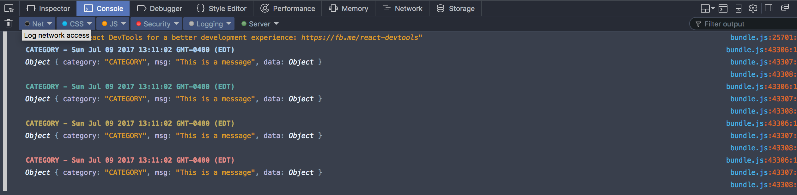

# Pretty Logs

[](https://travis-ci.org/tkjone/pretty-logs)
[](https://github.com/prettier/prettier)
[](https://codecov.io/gh/tkjone/pretty-logs)


Welcome to `pretty-logs`.  `pretty-logs` is a JavaScript logging tool.

**WARNING:**

This library is still under active development and the API is likely to change.  This was evidenced in the jumpt form `0.4.2` to `0.5.0`.

* [Quickstart](#quickstart)
* [Usage](#usage)
* [Motivation](#motivation)
* [Contributing](#contributing)
  * [Getting Started](#getting-started)
  * [scripts](#scripts)
  * [Git Workflow](#git-workflow)
  * [Git Commit Messages](#git-commit-messages)
  * [Git Rules](#git-rules)
  * [Git Hooks](#git-hooks)
* [Related](#related)
* [Notes](#notes)
* [Special Thanks](#special-thanks)

# Quickstart

```js
npm install pretty-logs
```

# Usage

```js
import plog from 'pretty-logs';

plog({ level: 'debug', message: 'Login debug', extra: { category: 'AUTH' }});

plog({ level: 'info' , message: 'Login info', extra: { category: 'AUTH' }});

plog({ level: 'warn' , message: 'Login warn', extra: { category: 'AUTH' }});

plog({ level: 'error' , message: 'Login error', extra: { category: 'AUTH' }});
```

Here is how the above looks in the console



You can play with this library at [pretty-logs sandbox](https://codesandbox.io/s/Bg39JKY5N).

**NOTE:**

The above will work very well on Safari and Chrome, however, Firefox and IE/Edge are inconsistent.  As a result, we have added a safe mode for these inconsistent browsers.  The safe mode will render like this:

**FireFox (54)**



**FireFox Developer Edition**



# Motivation

This library was created because I became tired of moving my custom rolled logging library from project-to-project.
I wanted this to be an easy way to use this minimal library in my future projects and pick up on the improvements I make as i go.  I also
wanted to work with open source projects and attempt to maintain my own.

# Contributing

I am always happy to have people contribute to this project.  Please start by reading this projects code of conduct.

## Getting Started

**1. clone repo**

```bash
git clone git@github.com:tkjone/pretty-logs.git
```

**2. move into pretty-log directory**

```bash
cd ./path/to/pretty-logs
```

**3. install dev dependencies**

```bash
npm install
```

**4. sanity-check - run tests**

```bash
npm test
```

> Please note that the tests are super baren right now.  Step 4 is meant to illustrate a working project.

From here, you can checkout `pretty-logs` in an example app to see what it looks like by moving into `examples/example-app` and than run `npm install` and `npm start`.  If you open the console you will see your nicely formatted logs.

> The above works because we `npm link` pretty-logs.  See `package.json`.

## Scripts

If you intend on running the `generate-changelog` command you will need to install `github-changes` globally first:

```bash
npm install github-changes -g
```

After you have cloned this repo and installed the npm dependencies, it is a good practice to run `npm run validate`.  This script is going to run prettier and the tests.

## Git Workflow

We use [Github Flow](https://guides.github.com/introduction/flow/) and [Interactive Rebasing](https://www.atlassian.com/git/tutorials/merging-vs-rebasing#the-golden-rule-of-rebasing) for this project.  Here is a simple overview of this workflow:

**1.  Checkout a new feature/bug-fix branch based off master**

```bash
git checkout -b <branchname>
```

**2.  Add commits**

```bash
git add
git commit
```

**3.  Get latest from master**

```bash
git fetch origin
```

**4.  Sync with master through interactive rebasing - [Here's Why](https://www.atlassian.com/git/tutorials/merging-vs-rebasing#the-golden-rule-of-rebasing)**

```bash
git rebase origin/master
```

**4.  If you don't have conflicts, skip this step.  Otherwise, [resolving them](https://help.github.com/articles/resolving-merge-conflicts-after-a-git-rebase/).**

```bash
git rebase <resolving-command-specific-to-your-case>
```

**5.  Cleanup your branch through rebasing - [see here](https://github.com/edx/edx-platform/wiki/How-to-Rebase-a-Pull-Request)**

```bash
git rebase -i HEAD~<how-far-back-you-want-to-go>
```

**6.  Push your branch**

```bash
git push origin <branchname>
```

**7.  Make a PR**

**8.  Have your PR code reviewed**

**8.  Once your PR is approved,  update the CHANGELOG and wait for it to be merged into master**


## Git Commit Messages

All commit messages must have a ***Subject*** and ***Body***.  Here is an example of the structure of our commit messages:

**Example**

```
issue <issue-number> <subject>
# blank line
<body>
```

For example:

```
issue #6 Formatting Safari

Resolves repeating images in the safari console
```

Also write your git commit messages using an imperative tone.  For example:

```bash
Add new linting tool

Limit the number of characters in string function
```

## Git Rules

These apply to git commit messages and pull requests

* All Feature work should be done on a feature branch
* The **subject** of the git commit message and pull request, should NOT exceed 50 characters
* The first word of the Subject, after the issue number, should be capitalized
* The **body** of the git commit message should wrap the line at 80 characters
* Always add the **Fixes issue-number** to the bottom of your pull requests body - [example here](https://github.com/tkjone/pretty-logs/pull/11)
* Git branch naming convention: `issue-6-descriptive-subject`
* Pull request body text should have details summarizing the problem and why the change was made
* Use a Pull Request whenever you want input from other developers.  Its not just for a completed piece of work
* Be sure to avoid rebasing over your own commits when you have created a pull request.  The problem with this is that if someone left a comment on one of the files you rebased, those comments will be lost.
* When merging a Pull Request, we use [squash and merge](https://help.github.com/articles/about-pull-request-merges/)

## Git Hooks

We have a pre-commit git hook, which runs when you run `git commit` locally.  This hool runs prettier. Big thanks to [husky](https://github.com/typicode/husky) which help make this process very easy.

# Related

[console.js](https://github.com/icodeforlove/Console.js/blob/master/console.js)
[console.style](https://github.com/daniellmb/console.style)
[log](http://adamschwartz.co/log/)
[log.js](https://github.com/adamschwartz/log/blob/master/log.js)
[winston](https://github.com/winstonjs/winston)
[log4js](https://github.com/stritti/log4js)

# Notes

This section just contains some knowledge that I acquired while developing/maintaining this library from an npm package perspective.  For example, running `npm version patch` will auto-incrememnt your package.json's `version` property.  Similiarly, you can swap `patch` for `minor` or `major`.  Very nice.

If you notice the version in our package.json is `"version": "0.0.0-semantically-released"` this is because we are handling this process with [semantinc-release-cli](https://github.com/semantic-release/cli)

# Special Thanks

<div>Icons made by <a href="http://www.flaticon.com/authors/dave-gandy" title="Dave Gandy">Dave Gandy</a> from <a href="http://www.flaticon.com" title="Flaticon">www.flaticon.com</a> is licensed by <a href="http://creativecommons.org/licenses/by/3.0/" title="Creative Commons BY 3.0" target="_blank">CC 3.0 BY</a></div>
